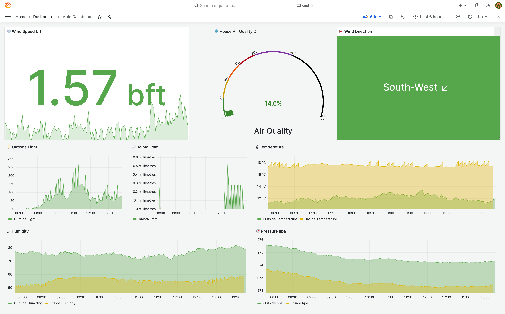
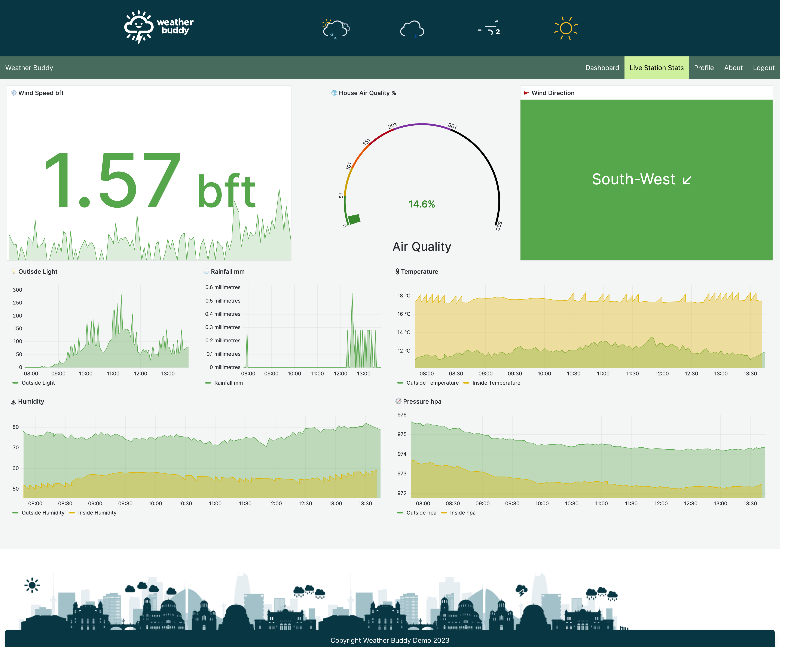
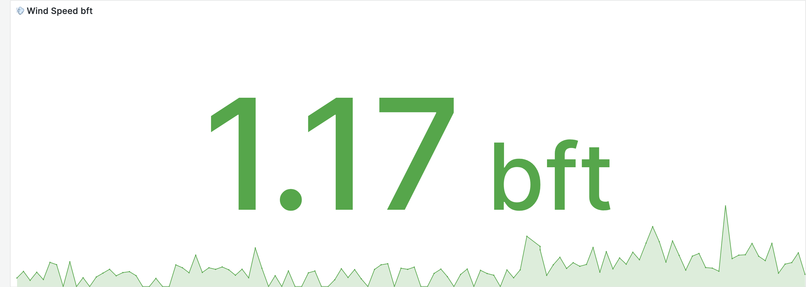
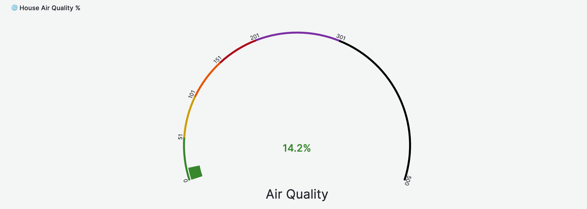
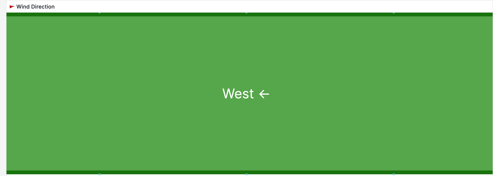
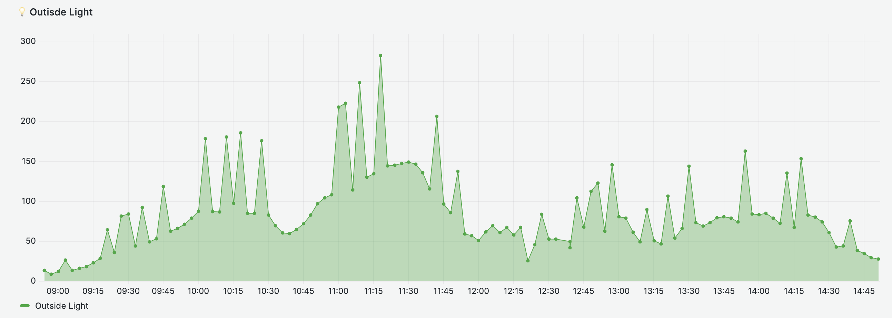
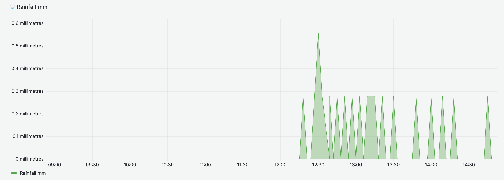
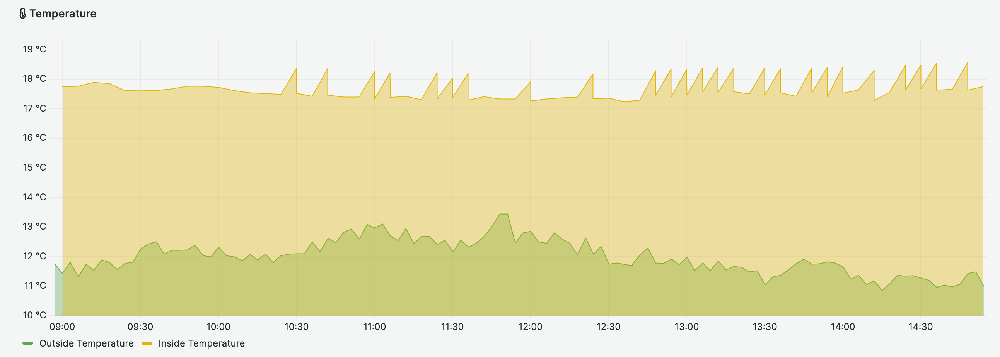
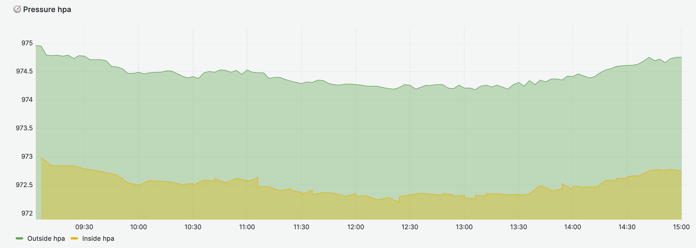

# Container for grafana

Grafana is an open-source platform for monitoring and observability. It allows you to query, visualize, alert on, and understand your metrics no matter where they are stored. In other words, you can create, explore, and share dashboards with your team and foster a data-driven culture.

Key features of Grafana include:

Visualizations: Grafana provides a variety of ways to visualize data, including graphs, histograms, heatmaps, and more.

Alerts: You can create alerting rules for your data and get notified through various channels.

Datasources: Grafana supports a wide range of databases, including but not limited to InfluxDB, Prometheus, Elasticsearch, MySQL, and PostgreSQL.

Annotations: You can annotate your graphs with log events, deployments, or any other event data from your systems.

---

## Table of Contents

- [Installation](#installation)
- [Usage](#usage)
- [Dasboard Screenshots](#Sreenshots-of-Grafana-admin-dashboard-and-webiste-iframe-dashboard)
- [InfluxDB queries for dashboard panels](#InfluxDB-queries-for-dashboard-panels)

---

## Installation

### Using Portainer to create a docker container:
Grafana docker container from DockerHub url: https://hub.docker.com/r/grafana/grafana

#### Portainer create new docker file settings:

- Image (Docker.io): grafana:latest
- Always pull the image: On

#### Advanced settings:

Command & logging (settings)
- Console: interactive
- ENV (enviornment variables to pass to container)
    - GF_AUTH_ANONYMOUS_ENABLED: true (allows anonymous user access to dashboard)
    - GF_AUTH_ANONYMOUS_ORG_NAM: weather-buddy
    - GF_AUTH_ANONYMOUS_ORG_ROLE: Viewer
    - GF_PANELS_DISABLE_SANITIZE_HTML: true
    - GF_PATHS_CONFIG: /etc/grafana/grafana.ini
    - GF_PATHS_DATA: /var/lib/grafana   
    - GF_PATHS_HOME: /usr/share/grafana
    - GF_PATHS_LOGS: /var/log/grafana
    - GF_PATHS_PLUGINS: /var/lib/grafana/plugins
    - GF_PATHS_PROVISIONING: /etc/grafana/provisioning
    - GF_SECURITY_ALLOW_EMBEDDING: true (this allows iframe which is disallowed by default)
    - GF_SECURITY_COOKIE_SAMESITE: disabled (this allows iframe which is disallowed by default)
- Restart policy: Unless Stopped

---

## Usage

Grafana is used in this project assignment to visualise data that comes from the infuxdb, Emoji's are used in the grafana titel's and also data from Influxdb for visual icons, for example the emoji's ⬇ ↘ ⬆ ↗ ➞ ↖ ↙ ← are used to visually show wind direction in the dashboard

Emoji's were sourced from below link (seranc for emoji's) 
https://emojidb.org/scale-emojis?

There are 2 distinct data sources displayed in Grafana which are outside weather data and inside weather data which are overlayed to show differences for example temperature outside vs temperatire inside (goal would be to add in more data sources inside to build out this dashboard - not achievable in current time frame of assignment).

## Sreenshots of Grafana admin dashboard and webiste iframe dashboard

### Grafana Admin Dashboard


### Grafana Website Dashboard with Iframe


---

## InfluxDB queries for dashboard panels

Title 💨 Wind Speed bft (this is a Stat panel)

    ```
    from(bucket: "weather_readings")
    |> range(start: v.timeRangeStart, stop: v.timeRangeStop)
    |> filter(fn: (r) => r._measurement == "wind speed")
    |> map(fn: (r) => ({ r with _field: "Wind Speed bft" }))
    ```



Hidden Block (this is a text panel)
This block runs a script that passes the height of dashboard from iframe to the parent site so there are no scroll bars in the iframe

    ```javascript
    <script>
    var intervalId = setInterval(function() {
    var element = document.querySelector('.css-1978mzo-canvas-content');
    if (element) {
        var height = element.scrollHeight;
        height += 50; // account for top bar space
        console.log('Sending height:', height);
        window.parent.postMessage({ 'iframeHeight': height }, '*');
    }
    }, 1000); // Send height every 1 second

    // Listen for confirmation message from parent page
    window.addEventListener('message', function(event) {
    if (event.data === 'height received') {
        console.log('Parent page has received the height');
        clearInterval(intervalId); // Stop sending height
    }
    });
    </script>
    ```

🌐 House Air Quality % (this is a Gauge panel)

    ```
    from(bucket: "indoor_upstairs_landing")
    |> range(start: -1h)
    |> filter(fn: (r) => r._measurement == "air_quality")
    |> map(fn: (r) => ({ r with _field: "Air Quality 0-500" }))
    ```


🚩 Wind Direction (this is a Canvas panel)
Colour and text styling is done in the edit sidepanel of this edit panel screen

    ```
    from(bucket: "weather_readings")
    |> range(start: -6h)
    |> filter(fn: (r) => r._measurement == "wind letter")
    |> map(fn: (r) => ({ r with _field: "Outside wind direction" }))
    ```



💡 Outisde Light (this is a Time series panel)

    ```
    from(bucket: "weather_readings")
    |> range(start: v.timeRangeStart, stop: v.timeRangeStop)
    |> filter(fn: (r) => r._measurement == "light")
    |> map(fn: (r) => ({ r with _field: "Outside Light" }))
    ```



🌧️ Rainfall mm (this is a Time series panel)

    ```
    from(bucket: "weather_readings")
    |> range(start: v.timeRangeStart, stop: v.timeRangeStop)
    |> filter(fn: (r) => r._measurement == "rain")
    |> map(fn: (r) => ({ r with _field: "Rainfall mm" }))
    ```



🌡 Temperature (this is a Time series panel)
This requires 2 queries for outsode and inside influxdb data buckets

    ```
    from(bucket: "weather_readings")
    |> range(start: v.timeRangeStart, stop: v.timeRangeStop)
    |> filter(fn: (r) => r._measurement == "temperature")
    |> map(fn: (r) => ({ r with _field: "Outside Temperature" }))
    ```

    ```
    from(bucket: "indoor_upstairs_landing")
    |> range(start: v.timeRangeStart, stop: v.timeRangeStop)
    |> filter(fn: (r) => r._measurement == "temperature")
    |> map(fn: (r) => ({ r with _field: "Inside Temperature" }))
    ```



♨ Humidity (this is a Time series panel)
This requires 2 queries for outsode and inside influxdb data buckets

    ```
    from(bucket: "weather_readings")
    |> range(start: v.timeRangeStart, stop: v.timeRangeStop)
    |> filter(fn: (r) => r._measurement == "humidity")
    |> map(fn: (r) => ({ r with _field: "Outside Humidity" }))
    ```

    ```
    from(bucket: "indoor_upstairs_landing")
    |> range(start: v.timeRangeStart, stop: v.timeRangeStop)
    |> filter(fn: (r) => r._measurement == "humidity")
    |> map(fn: (r) => ({ r with _field: "Inside Humidity" }))
    ```


🧭 Pressure hpa (this is a Time series panel)
This requires 2 queries for outsode and inside influxdb data buckets

    ```
    from(bucket: "weather_readings")
    |> range(start: v.timeRangeStart, stop: v.timeRangeStop)
    |> filter(fn: (r) => r._measurement == "pressure")
    |> map(fn: (r) => ({ r with _field: "Outside hpa" }))
    ```

    ```
    from(bucket: "indoor_upstairs_landing")
    |> range(start: v.timeRangeStart, stop: v.timeRangeStop)
    |> filter(fn: (r) => r._measurement == "pressure")
    |> map(fn: (r) => ({ r with _field: "Inside hpa" }))
    ```
