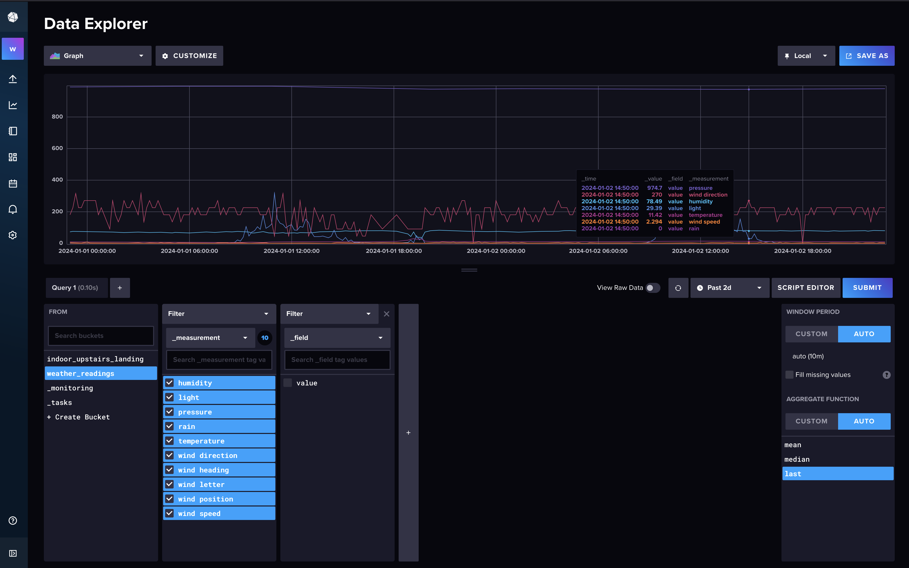
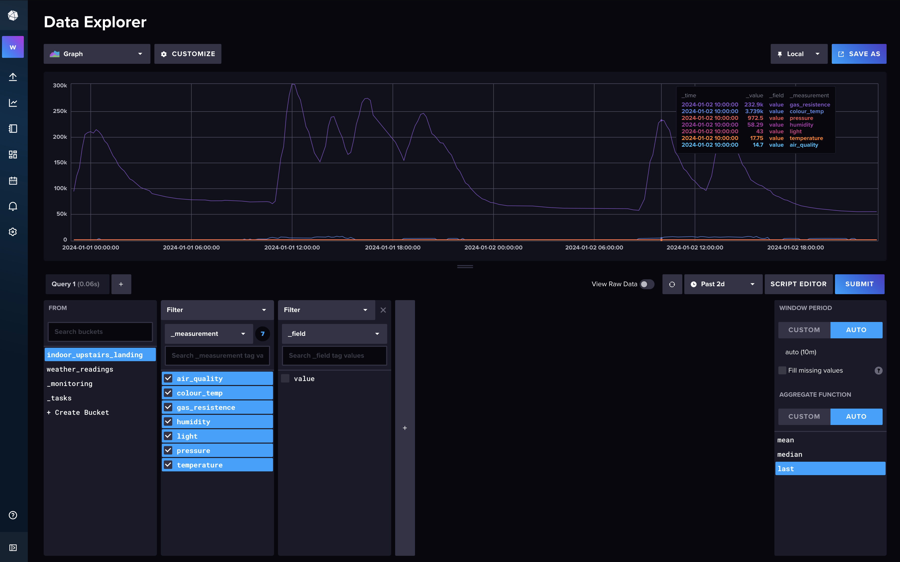

>> [Back to Main Project README.MD file](../README.md)

# Table of Contents

- [Container Description](#Container-for-influxdb)
- [Installation](#installation)
- [Usage](#usage)
- [Dasboard Screenshots](#Sreenshots-of-Infuxdb-admin-dashboard-and-webiste-iframe-dashboard)
- [Reources](#resources)

---

## Container for influxdb

InfluxDB is an open-source time series database developed by InfluxData. It is written in Go and optimized for fast, high-availability storage and retrieval of time series data in fields such as operations monitoring, application metrics, Internet of Things sensor data, and real-time analytics.

InfluxDB supports a SQL-like query language for interacting with data. It's designed to handle high write and query loads and provides a feature-rich query language for interacting with the data.

Key features of InfluxDB include:

Time Series Data Storage: InfluxDB is designed to store time-stamped data, making it useful for tracking changes over time.

Data Compression: InfluxDB compresses data to save storage space.

Continuous Queries: InfluxDB can compute and store query results automatically and periodically.

RetentionPolicy: InfluxDB automatically deletes old data that is no longer needed.

>> [Back to Top](#Table-of-Contents)
---

## Installation

### Using Portainer to create a docker container:
InfluxDb docker container from DockerHub url: https://hub.docker.com/_/influxdb

#### Portainer create new docker file settings:

- Image (Docker.io): influxdb:latest
- Always pull the image: On

#### Advanced settings:

Command & logging (settings)
- Console: interactive
- ENV (enviornment variables to pass to container)
    - DOCKER_INFLUXDB_INIT_BUCKET: weatherdubbybucket
    - DOCKER_INFLUXDB_INIT_CLI_CONFIG_NAME: default
    - DOCKER_INFLUXDB_INIT_ORG: weatherbuddy
    - DOCKER_INFLUXDB_INIT_PASSWORD: REMOVED FOR SECURITY
    - DOCKER_INFLUXDB_INIT_USERNAME: REMOVED FOR SECURITY
    - GOSU_VER: 1.16
    - INFLUX_CLI_VERSION: 2.7.3
    - INFLUX_CONFIGS_PATH: /etc/influxdb2/influx-configs
    - INFLUXD_INIT_PING_ATTEMPTS: 600
    - INFLUXD_INIT_PORT: 9999
    - INFLUXDB_VERSION: 2.7.4
    - PATH: /usr/local/sbin:/usr/local/bin:/usr/sbin:/usr/bin:/sbin:/bin
- Restart policy: Unless Stopped

Volumns (persistent storage for InfluxDb)
- influxdb-etc: /etc/influxdb2
- influxdb-data: /var/lib/influxdb2

>> [Back to Top](#Table-of-Contents)

---

## Usage

Inlfuxdb is used in this project assingment to store reading data by date for the outside-weather-station and indoor reading board sensors as seperate buckets to be queried in this case by Grafana appication, to build dashboard to visualise reading data collected over time.

>> [Back to Top](#Table-of-Contents)

---

## Sreenshots of InfuxDb admin dashboard and webiste iframe dashboard

### Main Influx Admin Dashboard with all data selected for outside wetaher readings (mouse hovered over chart for pop out data overlay)

### Main Influx Admin Dashboard with all data selected for inside readings (mouse hovered over chart for pop out data overlay)

>> [Back to Top](#Table-of-Contents)

---

## Resources

- https://grafana.com/docs/grafana/latest/datasources/influxdb/
- https://grafana.com/docs/grafana/latest/panels-visualizations/
- https://grafana.com/docs/grafana/latest/dashboards/
- https://community.grafana.com/t/-dashboard-using-iframe-not-opening-in-web-broweser-window/19304
- https://community.grafana.com/t/iframe-a-panel/67312
- https://www.itpanther.com/embedding-grafana-in-iframe/
- https://grafana.com/blog/2023/10/10/how-to-embed-grafana-dashboards-into-web-applications/
- https://stackoverflow.com/questions/65847384/embedding-a-website-in-a-grafana-dashboard

>> [Back to Top](#Table-of-Contents)

---

>> [Back to Main Project README.MD file](../README.md)