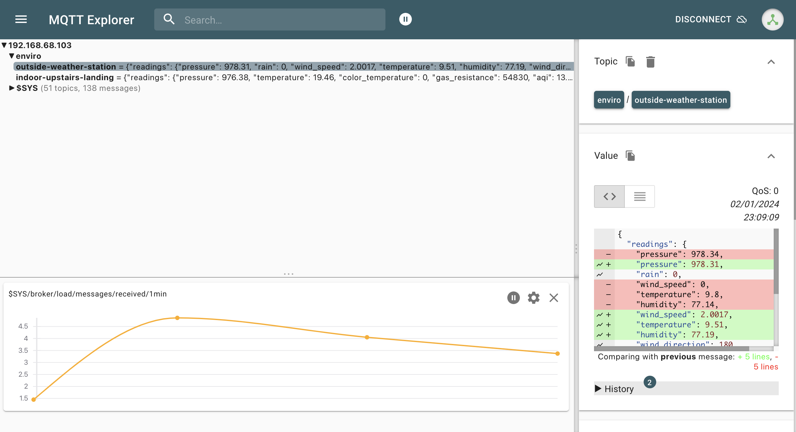

# Table of Contents

- [Container Description](#Container-for-mqtt)
- [Installation](#installation)
- [Usage](#usage)
- [MQTT Screenshot from MQTT Explorer app](#Sreenshot-of-MQTT-Broker-data-from-MQTT-Explorer-App)
- [Resources](#resources)

---

## Container for mqtt

MQTT (Message Queuing Telemetry Transport) is a lightweight, publish-subscribe network protocol that transports messages between devices. It is designed for high-latency or unreliable networks.

In MQTT, a central broker handles all messages. Devices, or "clients", connect to this broker and subscribe to topics they are interested in. When a message is published to a topic, the broker forwards the message to all clients who have subscribed to that topic.

MQTT supports three levels of Quality of Service (QoS) for message delivery:

"At most once", where messages are delivered according to the best efforts of the operating environment. Message loss can occur.
"At least once", where messages are assured to arrive but duplicates can occur.
"Exactly once", where message are assured to arrive exactly once. This is the safest but slowest option.
In your project, MQTT could be used for real-time data transmission from various sensors or devices to a central server or between components of your application.

>> [Back to Top](#Table-of-Contents)

---

## Installation

### Using Portainer to create a docker container:
MQTT Broker docker container from DockerHub url: https://hub.docker.com/_/eclipse-mosquitto

#### Portainer create new docker file settings:

- Image (Docker.io): eclipse-mosquitto:latest
- Always pull the image: On

#### Advanced settings:

Command & logging (settings)
- Console: interactive
- ENV (default variables when container is created)
    - DOWNLOAD_SHA256: retracted info
    - GPG_KEYS: retracted info
    - LWS_SH: retracted info
    - LWS_VERSION: 4.2.1
    - PATH: /usr/local/sbin:/usr/local/bin:/usr/sbin:/usr/bin:/sbin:/bin
    - VERSION: 2.0.18
- Restart policy: Unless Stopped

Volumns (persistent storage for MQTT Broker)
- mqtt_config: /mosquitto/config
- mqtt_data: /mosquitto/data
- mqtt_log: /mosquitto/log

>> [Back to Top](#Table-of-Contents)

---

## Usage

MQTT is used in this project to send data from sensors in Enviro weather and indoor boards to the MQTT brooker to 2 topics (this data is then subscribed to and process by other applications in this project assignment).

>> [Back to Top](#Table-of-Contents)

## Sreenshot of MQTT Broker data from MQTT Explorer App

### MQTT Explorer app showing MQTT Feeds

>> [Back to Top](#Table-of-Contents)

## Resources

### Youtube link for MQTT installing locally

[Direct Link to video](https://youtu.be/juSoczXtlxA?feature=shared)