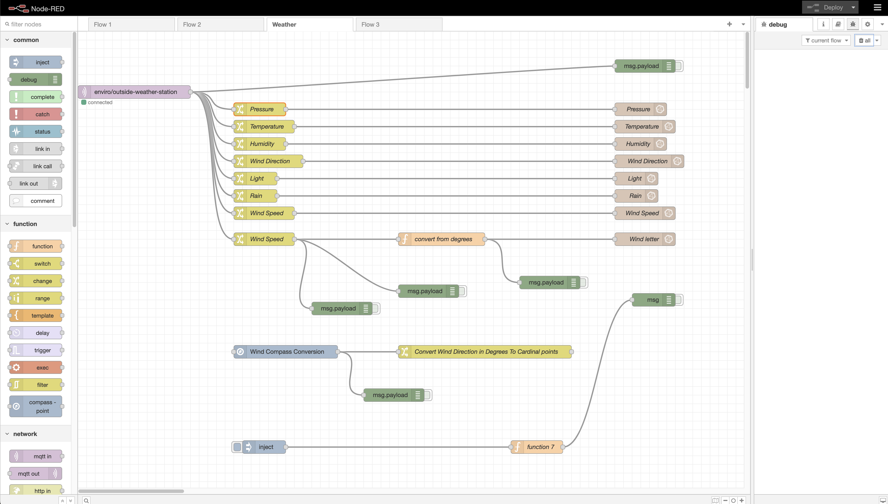

# Container for node-red

Node-RED is an open-source programming tool for wiring together hardware devices, APIs, and online services in new and interesting ways. It provides a browser-based flow editor that makes it easy to wire together flows using the wide range of nodes in the palette. Flows can be then deployed to the runtime in a single click.

Node-RED provides a visual interface for programming and is built on Node.js, taking full advantage of its event-driven, non-blocking model. This makes it ideal to run at the edge of the network on low-cost hardware such as the Raspberry Pi as well as in the cloud. With over 225,000 modules in Node's package repository, it is easy to extend the range of palette nodes to add new capabilities.

# Table of Contents

- [Installation](#installation)
- [Usage](#usage)
- [Node-red Dasboard Screenshots](#Sreenshots-of-node-red-dashboard)
- [MQTT Brooker set up](#(MQTT-in)-node-used-to-connect-the-MQTT-broker-feed-into-Node-Red)
- [MQTT Readings split up](#MQTT-readings-split-up)
- [InfluxDB node set up](#InfluxDb-node-set-up)
- [Node-Red Debug](#node-red-debug)

## Installation

### Using Portainer to create a docker container:
Node-Red docker container from DockerHub url: https://hub.docker.com/r/nodered/node-red-docker

#### Portainer create new docker file settings:

- Image (Docker.io): /node-red/node-red-docker
- Always pull the image: On

#### Advanced settings:

Command & logging (settings)
- Console: interactive
- ENV (default variables when container is created)
    - FLOWS: flows.json
    - NODE_PATH: /usr/src/node-red/node_modules:/data/node_modules
    - NODE_RED_VERSION: v3.1.3
    - NODE_VERSION: 16.20.2
    - PATH: /usr/src/node-red/node_modules/.bin:/usr/local/sbin:/usr/local/bin:/usr/sbin:/usr/bin:/sbin:/bin
    - YARN_VERSION: 1.22.19
- Restart policy: Unless Stopped

Volumns (persistent storage for Node-Red)
- node-red_data: /data

>> [Back to Top](#Table-of-Contents)

## Usage

Node-Red is used in project to pass data from the local mqtt broker to Infuxdb while manipulating the MQTT data feed through functions. Node-Red is used to manipulate 2 feeds for outside-weather-station and indoor-upstairs-landing MQTT feeds.

## Sreenshots of node red dashboard

### Node-red dashboard interface

>> [Back to Top](#Table-of-Contents)

## MQTT BRoker set up

### (MQTT in) node used to connect the MQTT broker feed into Node-Red

Properties of node connection:
- Name: outside_weather_station
- Connection details:
    - Server: 192.168.68.103
    - Port: 1883
- Security:
    - Username: mqtt
    - Password: retracted for security
- Messages:
    - Topic: enviro/outside-weather-station
    - QoS: 2 (QoS 2 offers the highest level of service in MQTT, ensuring that each message is delivered exactly once to the intended recipients. To achieve this, QoS 2 involves a four-part handshake between the sender and receiver.)

>> [Back to Top](#Table-of-Contents)

## MQTT Readings split up

### Multiple (Switch) nodes used to seperate out a single object value from MQTT broker feed
Pressure Switch:
- Rules:
    - Set: msg.payload
    - to the value: msg.payload.readings.pressure

Temperature Switch:
- Rules:
    - Set: msg.payload
    - to the value: msg.payload.readings.temperature

Humidity Switch:
- Rules:
    - Set: msg.payload
    - to the value: msg.payload.readings.humidity

Wind Direction Switch:
- Rules:
    - Set: msg.payload
    - to the value: msg.payload.readings.wind_direction

Light Switch:
- Rules:
    - Set: msg.payload
    - to the value: msg.payload.readings.luminance

Rain Switch:
- Rules:
    - Set: msg.payload
    - to the value: msg.payload.readings.rain

Wind Speed Switch:
- Rules:
    - Set: msg.payload
    - to the value: msg.payload.readings.wind_speed

Wind Speed Switch:
- Rules:
    - Set: msg.payload
    - to the value: msg.payload.readings.wind_direction

>> [Back to Top](#Table-of-Contents)

## InfluxDB node set up

Node-Red pallete install of node-red-contrib-influxdb

(Influxdb in) node used to pass data from swicth statement nodes to save to InfluxDB

InfluxDB node set up for Pressure entry
- URL: http://192.168.68.115:8086
- Token: retrcted for security
- Prperties:
    - Organisation: weather-buddy
    - Bucket: weather_readings
    - measurement: pressure

InfluxDB node set up for Temperature entry
- URL: http://192.168.68.115:8086
- Token: retrcted for security
- Prperties:
    - Organisation: weather-buddy
    - Bucket: weather_readings
    - measurement: temperature

InfluxDB node set up for Humidity entry
- URL: http://192.168.68.115:8086
- Token: retrcted for security
- Prperties:
    - Organisation: weather-buddy
    - Bucket: weather_readings
    - measurement: humidity

InfluxDB node set up for Wind Direction entry
- URL: http://192.168.68.115:8086
- Token: retrcted for security
- Prperties:
    - Organisation: weather-buddy
    - Bucket: weather_readings
    - measurement: wind direction

InfluxDB node set up for Light entry
- URL: http://192.168.68.115:8086
- Token: retrcted for security
- Prperties:
    - Organisation: weather-buddy
    - Bucket: weather_readings
    - measurement: light

InfluxDB node set up for Rain entry
- URL: http://192.168.68.115:8086
- Token: retrcted for security
- Prperties:
    - Organisation: weather-buddy
    - Bucket: weather_readings
    - measurement: rain

InfluxDB node set up for Wind Speed entry
- URL: http://192.168.68.115:8086
- Token: retrcted for security
- Prperties:
    - Organisation: weather-buddy
    - Bucket: weather_readings
    - measurement: wind-speed

InfluxDB node set up for Wind letter entry
- URL: http://192.168.68.115:8086
- Token: retrcted for security
- Prperties:
    - Organisation: weather-buddy
    - Bucket: weather_readings
    - measurement: wind letter

>> [Back to Top](#Table-of-Contents)

## Node-Red debug
(debug) node is used to output messaging and errors from each flow to check expected v's received data value and format

>> [Back to Top](#Table-of-Contents)