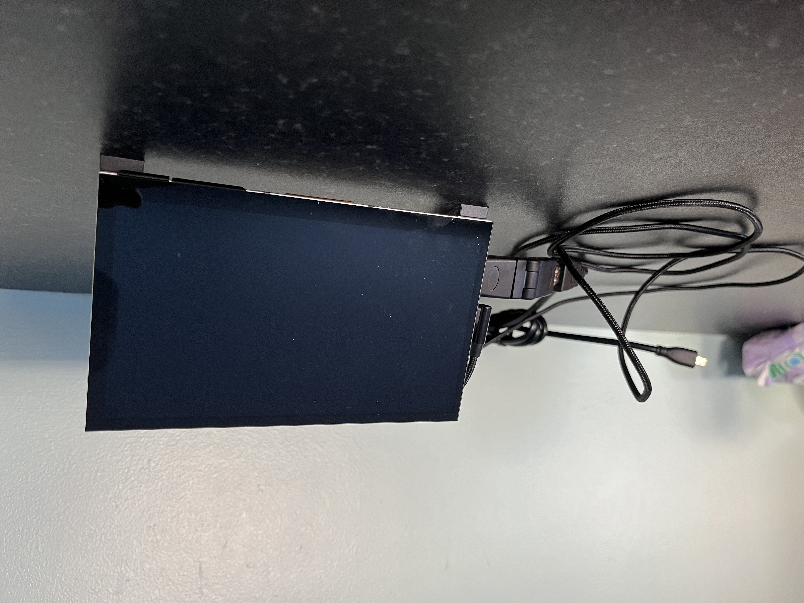
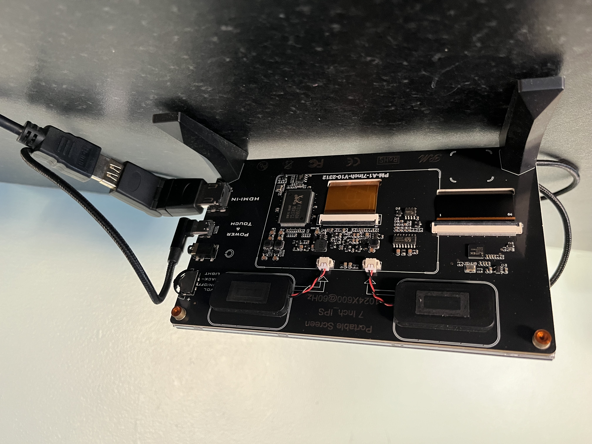

## Table of Contents

- [Installation](#installation)
- [Brief Description](#brief-description-of-assignment)
- [Features Of Website](#features-that-have-been-implemented)
- [Technology Used](#technology-used)

---

## Installation

- Install Node from this link https://nodejs.org/en (follow instructions to install)
- Install Visual Studio for development of Model View Controller https://code.visualstudio.com/
- Express.js and Handlebars.js:
    - Open a terminal or command prompt.
    Navigate to your project directory.
    - Run the following commands to install Express.js and Handlebars.js using npm:npm install express express-handlebars
- Create Your Project File structure for Model View Controller
- set up server.js file (extract below of server.js file)
```
import 'dotenv/config';
import express from "express";
import bodyParser from "body-parser";
import cookieParser from "cookie-parser";
import fileUpload from "express-fileupload";
import { engine } from "express-handlebars";
import { router } from "./routes.js";
import { handlebarsHelpers } from "./helpers/handlebars-helpers.js";

const app = express();
app.use(cookieParser());
app.use(bodyParser.urlencoded({ extended: false }));
app.use(express.static("public"));
app.use(fileUpload());
app.engine(".hbs", engine({ extname: ".hbs", helpers: handlebarsHelpers }));
app.set("view engine", ".hbs");
app.set("views", "./views");
app.use("/", router);

const listener = app.listen(process.env.PORT || 4000, function () {
  console.log(`Todolist started on http://localhost:${listener.address().port}`);
});
```
- Run command in terminal in project folder: npm start
- Application will run on: http://localhost:4000/


>> [Back to Top](#Table-of-Contents)

---

# Brief description of assignment

Readings and stations are displayed to user in an attractive interface showing the member there historical readings and Converted reading data with stats based on reading data, trend charts and interactove maps have also been added to this project. This site is hosted on a raspberry pi on a local network. This local network site displays the Grafana dashboard in an iframe from the influxdb database with comparison of outside and inside readings. I had initially used a touch screen but the input without keyboard proved to be an issue so i used a tablet instead as it had the ui interface for keyboard and user input

Touchscreen device for local webiste interaction



Tablet device for local webiste interaction (i went ewith this option in the end)


>> [Back to Top](#Table-of-Contents)

---

# Features that have been implemented

1. Initial values are read in from Mongo Atlas Database
   - Station 
        1. Name 
        2. Latitude 
        3. Longitude 
        4. attached readings
   - Station Readings 
        1. Date 
        2. Code 
        3. Temperature 
        4. WindSpeed 
        5. WindDirection 
        6. Pressure
   - Member/User 
        1. Email 
        2. First Name 
        3. Last Name 
        4. Password 
        5. Stations
2. User visits site and has option to login or Signup/Register.
3. Users Readings are displayed which contain
    - Date of reading created
    - Weather Code
    - Temperature
    - WindSpeed
    - WindDirection
    - Pressure
4. Temperature is converted and displayed in both C & F.
5. WindSpeed is converted in Beaufort scale to user, and also accompanied by text description of Beaufort number.
6. WindDirection is converted from 0-360 value range to compass direction eg:"North East".
7. WindSpeed is converted to WindChill.
8. Ability to add station attached to logged in Member, add station form accepts Name, Lat " limited values between -90 to 90" and Long "limited values between -180 to 180" for new station entry (double clicking map loads lat and long into station form).
9. Ability to add new Readings "Unlimited readings", Date is auto assigned with user form submission of Weather Code, Temperature, WindSpeed "limited values between 0 to 117", WindDirection "limited values between 0 to 360", Pressure.
10. Ability to delete station attached to logged in Member/User.
11. Ability to delete Readings attached to stations.
12. Ability to delete Member/User from application and all there attached stations including all attached station readings.
14. Seperated Station and Reading views.
15. Latest readings has Weather icons assigned
    - Location
    - Weather Code
    - Temperature
    - Wind
    - Pressure
16. Min and Max values are displayed for
    - Temperature
    - Wind
    - Pressure
17. Trends are displayed for Temperature, Wind, Pressure with icons and text for values Falling, Stable and Rising based on last 3 readings from user.
18. Trend graphs are also diplsyed with 8 day forcase.
19. Member/User profile page to display user details including
    - Email
    - First Name
    - Last Name
    - Password "password is hidden with \*\*\*"
    - Confirm password
20. Ability to update users profile for
    - First Name
    - Last Name
    - Password (must match confirm password field to save)
    - But email is unique identifier for account and can not be changed "this is by design"
21. Custom 404 page
22. Required attribute added to form fields to ensure values for Stations, Readings and Member/User profile data.
23. Duplicate password fields to check for matching passwords "type in password twice to avoid typos" on both registrations, and profile update page.
24. Validating Email case with conversion to lowercase before Member/User is created and saved.
25. User confirmation for data deletion "Cancel and Confirm Deletion" on Station, Reading and Member/User deletion.
26. User confirmation messages for Profile update successful, account deletion, Login failed, duplicate email address.
27. Latest Readings not displayed in Reading list view until 1 reading is added & Trends only display when 3 readings are entered.
28. Custom icons added for all reading types and calculated reading type data.
29. Custom filled SVG icons for weather map display
30. Min and Max values assigned to form inputs to keep data within required data value ranges.
31. Iframe video of weather forecast data on home page.
32. Restricted route menu items are displayed for logged in users only as user validation is by middleware in the routes.js file
33. Animated icons for latest readings with wind icon animation speed + number based on Beaufort scale value.
34. Members cannot view other members stations or dashboards by directly hitting url’s of other users
35. Members or non members cannot enter, delete or modify station/reading/profile data by url’s
36. Handlebar helpers are used to display reading data based on number of readings attached to station
37. WeatherTop JS project assignment is fully responsive on mobile devices.
38. Grafana Dashboard added to display historical data from InfluxDB


>> [Back to Top](#Table-of-Contents)

---

# Technology Used

**Javascript** (Used in site for models and form fields)
Technology Description: JavaScript, often abbreviated as JS, is a programming language that is one of the core technologies of the World Wide Web, alongside HTML and CSS.

**Iframe** (Pull in weather widget map from https://www.windy.com)
Technology Description: An inline frame (iframe) is a HTML element that loads another HTML page within the document. It essentially puts another webpage within the parent page. They are commonly used for advertisements, embedded videos, web analytics and interactive content.

**Express JS** (web framework for Node.js)
Express is a minimal and flexible Node.js web application framework that provides a robust set of features for web and mobile applications.

**Handlebars JS** (JavaScript library used to create reusable webpage templates)
Handlebars compiles templates into JavaScript functions. This makes the template execution faster than most other template engines.

**Bulma framework** (used to build the frontend of site)
Technology Description: Bulma is a free, open source CSS framework based on Flexbox and built with Sass. It's 100% responsive, fully modular, and available for free.

**Mongo Atlas** (used to save data for site)
Technology Description: MongoDB Atlas is a fully-managed cloud database service provided by MongoDB. It automates the deployment, scaling, and operations of MongoDB databases in the cloud.

**Grafana** (used to display data from InfluxDB)
Technology Description: Grafana is an open-source analytics and monitoring platform that allows users to visualize and understand their data through customizable and interactive dashboards. 


>> [Back to Top](#Table-of-Contents)

---